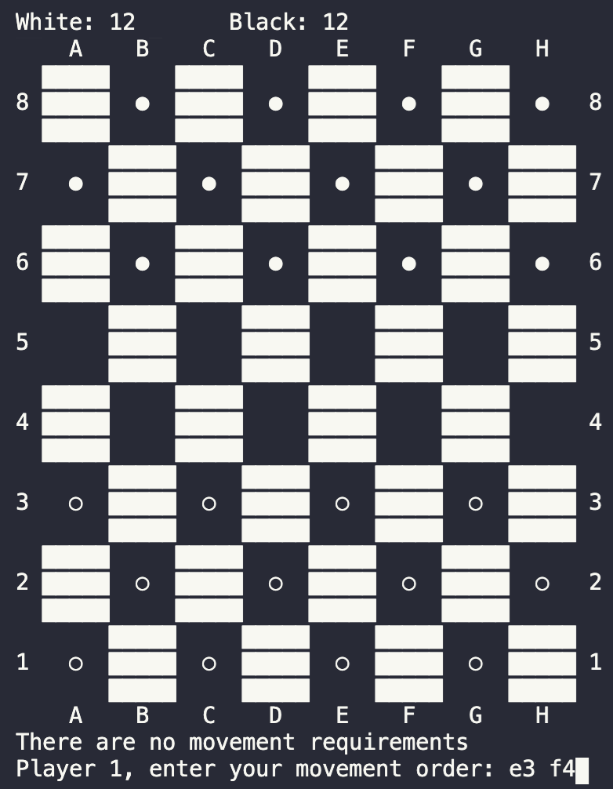

# Checkers in Rust

Checkers game implemented in Rust

## Rules 

The general rules of checker were applied. Some of them are:

- Black checkers play first
- Regular checker can only move forward and one slot per time
- Regular checkers can only make forward captures
- When reaching the furthes row, the checker turns into a king
- The king can move as many slots as desired, both backwards and forward
- The king can capture checkers over any diagonal line, as long as it lands on an empty slot and captures a single checker per time without going over an ally
- It is possible to make multiple jumps to capture multiple checkers, as long as the moving limitations are respected

Additionally, rules that may change from country to country were selected based on [this](https://www.thesprucecrafts.com/play-checkers-using-standard-rules-409287) website

# How to play

Upon opening the game, the following menu is shown

There it is possible to select which game mode is desired (only multiplayer mode is available at the moment). To select it, type the number next to the desired option and press `Enter`

After that menu, if the Multiplayer mode is selected the board is shown

To move a checker, type the path of its movement, starting with its initial position and adding a coordinate for every land made. The x-coordinate should go first, followes by the y-coordinate. The input is case insensitive, so in the image `e3 f4` yelds the same result as `E3 F4` or any other combination of upper and lower case. After writing the desired path, press `Enter` and it will be applied, as long as it is a valid one.

It is also possible to make multiple jumps, with a single input by adding the intermediate landing spots. Whenever it is possible to make a capture, the game will inform the user, who needs to move one of the show options to make the capture.

After the capture is made, the counter on top of the screen is updated with the number of remaining checkers of each color.

When a checker turns into a king, it's image change to a different one so that it can be later recognized.

The game ends when one of the colors is out of checkers.